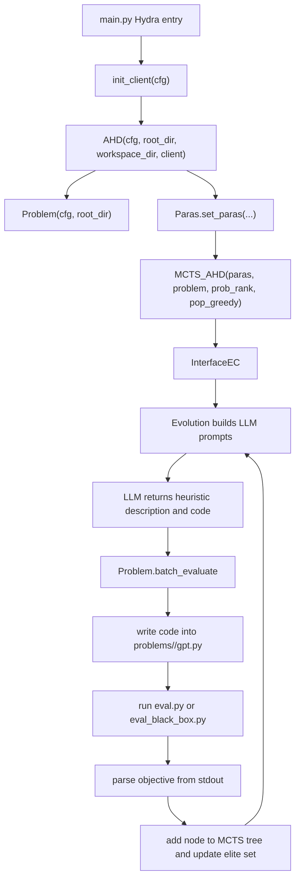

# MCTS-AHD 项目详细解读

本文档基于当前仓库源码整理，用于复现论文 *Monte Carlo Tree Search for Comprehensive Exploration in LLM-Based Automatic Heuristic Design* 时快速理解项目结构、核心算法、运行流程、实验配置和复现注意事项。

## 1. 项目定位

本项目实现的是 MCTS-AHD：用大语言模型自动设计启发式函数，并用 Monte Carlo Tree Search 组织、选择和扩展由 LLM 生成的候选启发式。项目的核心目标不是训练一个神经网络，而是反复执行以下闭环：

1. 给 LLM 一个优化问题描述、函数签名、输入输出约束和已有启发式。
2. 让 LLM 生成新的 Python 启发式函数代码。
3. 把生成代码写入对应问题目录的 `gpt.py`。
4. 调用该问题的 `eval.py` 或 `eval_black_box.py` 评估目标值。
5. 将候选函数及其目标值放入 MCTS 树。
6. 用 UCT 和多种演化算子继续探索更好的启发式。

仓库提供的任务覆盖组合优化、贝叶斯优化和 MountainCar 强化学习任务。大多数任务的被优化对象是一个很短的启发式函数，例如 TSP 构造式算法中的 `select_next_node`，ACO 中的 `heuristics` 矩阵生成函数，Online BPP 中的 `priority` 打分函数。

## 2. 当前本地仓库状态

当前路径：

```bash
/Users/ginwineli/WorkSpace/Project/Reproduction/MCTS-AHD-master
```

本地已经按复现需要重新初始化为新的 git 仓库，并删除了原作者仓库历史。当前初始提交为：

```bash
46d064c Initial project setup
```

当前无远程仓库。`.gitignore` 已忽略 Python 缓存、虚拟环境、临时评估目录和运行输出子目录，避免后续实验把大量中间文件误提交。

## 3. 顶层目录结构

```text
.
├── README.md
├── main.py
├── ahd_adapter.py
├── problem_adapter.py
├── cfg/
│   ├── config.yaml
│   ├── hydra/output/local.yaml
│   ├── llm_client/openai.yaml
│   └── problem/*.yaml
├── source/
│   ├── mcts_ahd.py
│   ├── mcts.py
│   ├── evolution.py
│   ├── evolution_interface.py
│   ├── getParas.py
│   ├── prob_rank.py
│   └── pop_greedy.py
├── utils/
│   ├── utils.py
│   └── llm_client/*.py
├── prompts/
│   └── <problem>/
│       ├── func_signature.txt
│       ├── func_desc.txt
│       └── seed_func.txt
├── problems/
│   └── <problem>/
│       ├── gpt.py
│       ├── eval.py
│       ├── eval-test.py
│       ├── gen_inst.py
│       └── dataset 或 instance
└── outputs/
    └── paper reported run archives
```

关键目录职责如下：

| 路径 | 作用 |
| --- | --- |
| `main.py` | Hydra 入口，创建 LLM client，启动 MCTS-AHD，结束后执行验证 |
| `ahd_adapter.py` | 将 Hydra 配置转换为 `Paras` 参数对象，并实例化 `MCTS_AHD` |
| `source/` | MCTS-AHD 核心搜索、演化提示词、LLM 接口、父代选择、精英集维护 |
| `problem_adapter.py` | 将任务配置、prompt 文件和 eval 脚本接到统一评估接口 |
| `cfg/` | Hydra 配置，决定任务、LLM、最大评估次数、种群规模、timeout |
| `prompts/` | 每个任务的函数签名、输入输出说明、seed 函数文本 |
| `problems/` | 每个任务的评估逻辑、数据集、当前最优或默认 `gpt.py` |
| `outputs/` | 作者提供的报告运行压缩包，以及本地新运行的输出目录 |

## 4. 环境与依赖

项目依赖固定在 `requirements.txt`。当前已创建 conda 环境：

```bash
conda activate mcts-ahd
python --version
```

验证过的核心版本：

```text
Python 3.10.20
torch 2.5.1
botorch 0.12.0
numba 0.60.0
numpy 1.26.3
```

建议使用 Python 3.10。不要直接用 base 环境中的 Python 3.13，因为 `numba==0.60.0`、`llvmlite==0.43.0`、`torch==2.5.1` 这类依赖与 Python 3.13 不匹配。

安装命令：

```bash
conda create -n mcts-ahd python=3.10 -y
conda activate mcts-ahd
python -m pip install -r requirements.txt
```

安装时可能出现两个非阻塞提示：

1. `protobuf==5.29.0` 是 yanked 版本。
2. `wheel` 声明需要 `packaging>=24.0`，但项目固定了 `packaging==23.2`。

当前 smoke test 已能正常运行，因此这两个提示暂不影响默认 TSP 评估。

## 5. 默认配置

默认主配置在 `cfg/config.yaml`：

```yaml
defaults:
  - _self_
  - problem: tsp_constructive
  - llm_client: openai
  - override hydra/output: local

hydra:
  job:
    name: ${problem.problem_name}-${problem.problem_type}
    chdir: True

algorithm: mcts_ahd
max_fe: 1000
pop_size: 10
init_pop_size: 4
timeout: 60
```

含义：

| 参数 | 含义 |
| --- | --- |
| `problem` | 选择问题配置，默认 `tsp_constructive` |
| `llm_client` | 选择 LLM 客户端，默认 OpenAI |
| `hydra.job.chdir` | 运行时切换到 Hydra 输出目录 |
| `max_fe` | 总函数评估次数上限 |
| `pop_size` | 精英集大小 |
| `init_pop_size` | 初始根节点子节点数量 |
| `timeout` | 单个候选启发式评估超时时间，单位秒 |

LLM 默认配置在 `cfg/llm_client/openai.yaml`：

```yaml
_target_: utils.llm_client.openai.OpenAIClient
model: gpt-4o-mini
temperature: 1.0
api_key: "INPUT_YOUR_OPENAI_API"
```

建议不要把真实 key 写入文件，而是在运行时覆盖：

```bash
export OPENAI_API_KEY="your_key"
python main.py llm_client.api_key="$OPENAI_API_KEY"
```

## 6. 总体执行链路

项目运行的主链路如下：



源码级入口：

1. `main.py`
   - 初始化日志。
   - 通过 Hydra 加载 `cfg/config.yaml`。
   - 调用 `utils.utils.init_client(cfg)` 创建 LLM client。
   - 实例化 `AHD`，调用 `lhh.evolve()`。
   - 将最终 `best_code_overall` 写入 `problems/<problem>/gpt.py`。
   - 调用验证脚本，把验证输出写入 `best_code_overall_val_stdout.txt`。

2. `ahd_adapter.py`
   - 创建 `Problem` 对象。
   - 创建 `Paras` 对象。
   - 将 Hydra 参数映射到 `Paras`：
     - `init_size = cfg.init_pop_size`
     - `pop_size = cfg.pop_size`
     - `ec_fe_max = cfg.max_fe`
     - `llm_model = client`
     - `exp_output_path = workdir`
     - `eva_timeout = cfg.timeout`
   - 实例化 `source.mcts_ahd.MCTS_AHD` 并运行。

3. `source/mcts_ahd.py`
   - 管理 MCTS 树。
   - 初始化根节点和初始子节点。
   - 按 UCT 选择节点。
   - 根据 `e1/e2/m1/m2/s1` 等算子扩展节点。
   - 保存 `population_generation_<eval_times>.json` 和 `best_population_generation_<eval_times>.json`。

4. `source/evolution_interface.py`
   - 连接 MCTS 和 LLM 生成器。
   - 对生成代码做去重、重试、评估。
   - 将候选代码封装成 `algorithm/code/objective` 字典。

5. `source/evolution.py`
   - 构造不同演化算子的 prompt。
   - 调用 LLM。
   - 从响应中抽取算法描述和 Python 函数代码。
   - 再让 LLM 根据代码重新描述算法思想，作为 `algorithm` 字段。

6. `problem_adapter.py`
   - 根据 `cfg/problem/*.yaml` 和 `prompts/<problem>` 构造任务 prompt。
   - 将 LLM 代码写入 `problems/<problem>/gpt.py`。
   - 调用评估脚本，并从 stdout 倒数第二行解析目标值。

## 7. MCTS-AHD 核心机制

### 7.1 MCTS 节点

`source/mcts.py` 定义了 `MCTSNode`：

| 字段 | 含义 |
| --- | --- |
| `algorithm` | LLM 对启发式的自然语言描述 |
| `code` | LLM 生成的 Python 函数代码 |
| `objective` | 存在 `raw_info["objective"]` 中，表示评估目标值 |
| `Q` | 节点价值，代码中设为 `-objective` |
| `visits` | 节点访问次数 |
| `children` | 子节点列表 |
| `children_info` | 子节点对应的原始候选字典 |
| `subtree` | 该根孩子下扩展出的后代样本，用于 `e1` 等操作 |
| `depth` | 树深度 |
| `parent` | 父节点 |

项目统一把搜索价值写成越大越好。对于最小化问题，评估目标越小越好，代码用 `Q = -objective` 将其转成越大越优。

### 7.2 UCT 选择

`MCTS.uct(node, eval_remain)` 的形式为：

```text
normalized_Q + exploration_constant * sqrt(log(parent.visits + 1) / node.visits)
```

其中：

```python
exploration_constant = exploration_constant_0 * eval_remain
```

默认：

| 参数 | 默认值 | 位置 |
| --- | --- | --- |
| `exploration_constant_0` | `0.1` | `source/mcts.py` |
| `alpha` | `0.5` | `source/mcts.py` |
| `max_depth` | `10` | `source/mcts.py` |
| `discount_factor` | `1` | `source/mcts.py` |

`eval_remain` 在主循环中传入 `max(1 - eval_times / fe_max, 0)`，因此搜索前期探索项更强，后期逐渐减弱，更偏向已有高价值节点。

### 7.3 回传

`MCTS.backpropagate(node)` 做三件事：

1. 将当前节点的 `Q` 放入 `rank_list` 并排序。
2. 更新全局 `q_min/q_max`，用于 UCT 归一化。
3. 沿父节点向上更新每个父节点的 `Q`，父节点取子节点中最好的 `Q`。

这里的回传不是传统的平均回报，而是更接近“子树最好值”回传。这样设计会让父节点代表其子树目前发现的最优启发式。

### 7.4 主循环

`MCTS_AHD.run()` 的流程可以拆成两段。

初始化阶段：

1. 用 `i1` 生成第一个启发式。
2. 继续用 `e1` 生成 `init_pop_size - 1` 个根节点子节点。
3. 每个候选都立即评估，并插入根节点的孩子列表。
4. 形成初始 `nodes_set` 精英池。

演化阶段：

1. 从根节点开始。
2. 对当前节点的子节点计算 UCT。
3. 选 UCT 最大的孩子继续向下。
4. 如果访问次数达到扩展条件，可能对根节点用 `e1`，对普通节点用 `e2` 做额外扩展。
5. 到达叶子或最大深度后，对当前节点按算子列表执行扩展。
6. 每轮保存当前 population 和 best population。

默认算子列表来自 `source/getParas.py`：

```python
ec_operators = ["e1", "e2", "m1", "m2", "s1"]
ec_operator_weights = [0, 1, 2, 2, 1]
```

注意 `e1` 的默认权重为 0，但初始化阶段会显式使用 `e1`。主循环中普通叶子扩展时实际重点使用 `e2/m1/m2/s1`。

## 8. 演化算子解释

`source/evolution.py` 为每种算子构造不同 prompt。它们本质上都是“给 LLM 不同上下文，让 LLM 生成新函数”。

| 算子 | 代码入口 | 设计意图 |
| --- | --- | --- |
| `i1` | `get_prompt_i1` | 不给父代，直接根据问题描述生成一个初始算法 |
| `e1` | `get_prompt_e1` | 给多个现有算法，要求生成形式完全不同的新算法 |
| `e2` | `get_prompt_e2` | 给多个父代，要求新算法与最后一个父代形式相近，同时受第一个父代启发 |
| `m1` | `get_prompt_m1` | 基于单个父代做结构变化，引入新机制、新公式或新程序段 |
| `m2` | `get_prompt_m2` | 基于单个父代调整参数和公式 |
| `s1` | `get_prompt_s1` | 汇总一条路径上的多个算法，抽取共同有效思想并生成新算法 |

选择父代的逻辑在 `source/prob_rank.py`：

| 函数 | 逻辑 |
| --- | --- |
| `parent_selection` | 按排序位置给权重，越靠前权重越高 |
| `parent_selection_e1` | 均匀随机选父代 |

精英池管理在 `source/pop_greedy.py`：

| 函数 | 逻辑 |
| --- | --- |
| `population_management` | 去除相同 objective，保留 objective 最小的前 `size` 个 |
| `population_management_s1` | 去除相同 algorithm 后取 objective 最大的若干个，用于路径汇总场景 |

对于最小化任务，主精英池保留低 objective 候选。`population_management_s1` 使用 `nlargest`，与常规最小化精英选择不同，应理解为给 `s1` 路径汇总提供不同样本，而不是最终精英选择。

## 9. LLM 接口层

LLM client 初始化在 `utils/utils.py`：

1. 如果配置中直接有 `model` 字段，则按模型名前缀选择：
   - `gpt*` 使用 `OpenAIClient`
   - `GLM*` 使用 `ZhipuAIClient`
   - 其他走 `LlamaAPIClient`
2. 默认 Hydra 配置走 `hydra.utils.instantiate(cfg.llm_client)`，也就是 `utils.llm_client.openai.OpenAIClient`。

OpenAI 调用在 `utils/llm_client/openai.py`：

```python
self.client.chat.completions.create(
    model=self.model,
    messages=messages,
    temperature=temperature,
    n=n,
    stream=False,
)
```

`source/interface_LLM.py` 对上层暴露统一的 `get_response(prompt_content, temp=1.)`，实际调用：

```python
client.chat_completion(1, [{"role": "user", "content": prompt_content}], temperature=temp)
```

`BaseClient.chat_completion` 最多尝试 1000 次，每次失败记录异常并等待 1 秒。这样能扛住临时 API 错误，但如果 API key 错误或额度耗尽，会长时间重复失败。

## 10. Prompt 与问题适配契约

每个问题一般有三类 prompt 文件：

| 文件 | 作用 |
| --- | --- |
| `func_signature.txt` | LLM 必须实现的函数签名 |
| `func_desc.txt` | 输入输出变量含义和约束 |
| `seed_func.txt` | seed 函数文本，主要用于记录或给其他 baseline 参考 |

`problem_adapter.Prompts` 会读取函数签名，并通过正则提取函数名和输入变量：

```text
def <func_name>(<inputs>) -> <return_type>:
```

它再根据函数名前缀推断输出变量名：

| 函数名前缀 | 输出名 |
| --- | --- |
| `select_next_node` | `next_node` |
| `priority` | `priority` |
| `heuristics` | `heuristics_matrix` |
| `crossover` | `offsprings` |
| `utility` | `utility_value` |
| 其他 | `result` |

Black-box 任务有一个特殊路径规则：如果 `problem_type == "black_box"`，prompt 目录会自动追加 `_black_box` 后缀。例如：

```text
cfg/problem/tsp_aco_black_box.yaml
problem_name: tsp_aco
problem_type: black_box

prompt path:
prompts/tsp_aco_black_box/
```

## 11. 评估协议

所有候选启发式最终都通过 `Problem.batch_evaluate` 评估。该函数依赖一个强约定：

1. LLM 生成的代码会被写入：

```text
problems/<problem_name>/gpt.py
```

2. 对普通任务执行：

```bash
python -u problems/<problem_name>/eval.py <problem_size> <root_dir> train
```

3. 对 black-box 任务执行：

```bash
python -u problems/<problem_name>/eval_black_box.py <problem_size> <root_dir> train
```

4. eval 脚本必须把最终 objective 打印在 stdout 的倒数第二行。

代码中用如下方式解析目标值：

```python
individual["obj"] = float(stdout_str.split("\n")[-2])
```

因此扩展新问题时，`eval.py` 最后必须类似：

```python
print("[*] Average:")
print(objective_value)
```

对于最大化任务，`Problem.batch_evaluate` 会把 objective 取负：

```python
individual["obj"] = -individual["obj"] if self.obj_type == "max" else individual["obj"]
```

这样内部精英池仍然可以统一用“objective 越小越好”的逻辑。

## 12. 支持任务总览

当前 `cfg/problem` 下有以下配置：

| 配置 | problem_name | 类型 | 目标 | 训练规模 | LLM 生成函数 |
| --- | --- | --- | --- | --- | --- |
| `tsp_constructive` | `tsp_constructive` | constructive | min | 50 | `select_next_node` |
| `tsp_constructive_copy` | `tsp_constructive_copy` | constructive | min | 50 | `select_next_node` |
| `kp_constructive` | `kp_constructive` | constructive | max | 100 | `select_next_item` |
| `bpp_online` | `bpp_online` | online | min | 5000 | `priority` |
| `asp_constructive` | `asp_constructive` | constructive | max | 10 | `priority` |
| `tsp_aco` | `tsp_aco` | aco | min | 50 | `heuristics` |
| `tsp_aco_black_box` | `tsp_aco` | black_box | min | 50 | `heuristics` |
| `cvrp_aco` | `cvrp_aco` | aco | min | 50 | `heuristics` |
| `cvrp_aco_black_box` | `cvrp_aco` | black_box | min | 50 | `heuristics` |
| `mkp_aco` | `mkp_aco` | aco | max | 100 | `heuristics` |
| `mkp_aco_black_box` | `mkp_aco` | black_box | max | 100 | `heuristics` |
| `bpp_offline_aco` | `bpp_offline_aco` | aco | min | 500 | `heuristics` |
| `bpp_offline_aco_black_box` | `bpp_offline_aco` | black_box | min | 500 | `heuristics` |
| `tsp_gls` | `tsp_gls` | gls | min | 200 | `heuristics` |
| `bo_caf` | `bo_caf` | bo | min | 50 | `utility` |
| `car_mountain` | `car_mountain` | machine_learning | min | 100 | `choose_action` |

README 中说提供 15 个 scenario，当前配置文件数是 16。原因是仓库还包含 `tsp_constructive_copy`，用于并行评估或复制任务参考。

## 13. 典型问题目录说明

### 13.1 TSP constructive

路径：

```text
problems/tsp_constructive/
prompts/tsp_constructive/
cfg/problem/tsp_constructive.yaml
```

LLM 需要生成：

```python
def select_next_node(
    current_node: int,
    destination_node: int,
    unvisited_nodes: set,
    distance_matrix: np.ndarray
) -> int:
```

评估逻辑：

1. 从节点 0 开始构造 TSP tour。
2. 每一步调用 `select_next_node` 选择下一个未访问节点。
3. 如果返回已访问节点，会抛出错误并判为无效。
4. 最终计算闭环 tour 长度。
5. 训练集使用 `train50_dataset.npy`，64 个实例。
6. 验证集依次评估 20、50、100、200 节点规模。

该任务是最适合作为 smoke test 和初次复现入口的任务。

### 13.2 ACO 类任务

包括：

```text
tsp_aco
cvrp_aco
mkp_aco
bpp_offline_aco
```

LLM 主要生成 `heuristics` 矩阵或向量，由 ACO 求解器使用。普通 ACO 配置暴露较明确的距离、需求、奖赏、重量等结构化输入；black-box 配置隐藏问题语义，只提供 `edge_attr`、`node_attr`、`item_attr` 等抽象属性。

README 特别说明，复现 black-box 报告结果时应设置：

```bash
init_pop_size=10
```

### 13.3 Guided Local Search TSP

路径：

```text
problems/tsp_gls/
prompts/tsp_gls/
cfg/problem/tsp_gls.yaml
```

LLM 生成：

```python
def heuristics(distance_matrix: np.ndarray) -> np.ndarray:
```

评估逻辑会调用 `gls.py` 中的 guided local search。训练规模为 200，验证规模为 20、50、100、200。

### 13.4 Online BPP

路径：

```text
problems/bpp_online/
prompts/bpp_online/
cfg/problem/bpp_online.yaml
```

LLM 生成：

```python
def priority(item: float, bins_remain_cap: np.ndarray) -> np.ndarray:
```

该函数对当前 item 和已有 bin 剩余容量打分，评估器按优先级选择放入哪个 bin。README 特别说明，复现报告结果应设置：

```bash
max_fe=2000
```

### 13.5 BO CAF

路径：

```text
problems/bo_caf/
prompts/bo_caf/
cfg/problem/bo_caf.yaml
```

LLM 生成一个 acquisition utility：

```python
def utility(
    train_x,
    train_y,
    best_x,
    best_y,
    test_x,
    mean_test_y,
    std_test_y,
    cost_test_y,
    budget_used,
    budget_total
) -> torch.Tensor:
```

评估依赖 BoTorch 和 GPyTorch。该任务更重，适合作为环境确认后的后续复现实验。

### 13.6 MountainCar

路径：

```text
problems/car_mountain/
prompts/car_mountain/
cfg/problem/car_mountain.yaml
```

LLM 生成：

```python
def choose_action(pos: float, v: float, last_action: int) -> int:
```

README 提到需要安装 `gym` 才能运行该实验。当前 `requirements.txt` 未包含 `gym`，所以如果要复现 MountainCar，需要额外安装兼容版本，例如：

```bash
python -m pip install gym
```

## 14. 数据集与输出

仓库已包含大部分数据集。若缺失，各任务的 `eval.py` 通常会自动调用 `gen_inst.py` 生成。

主要数据规模：

| 任务 | 训练数据 | 验证数据 | 测试数据 |
| --- | --- | --- | --- |
| TSP constructive | 50 节点，64 实例 | 20/50/100/200 节点，各 64 实例 | 20/50/100/200/500/1000 节点，各 1000 实例 |
| KP constructive | 100 物品，64 实例 | 50/100/200，各 64 实例 | 50/100/200/500，各 1000 实例 |
| TSP ACO | 50 节点，5 实例 | 20/50/100，各 64 实例 | 50/100，各 64 实例 |
| CVRP ACO | 50 节点，10 实例 | 20/50/100，各 64 实例 | 50/100，各 64 实例 |
| TSP GLS | 200 节点，10 实例 | 20/50/100/200，各 64 实例 | 100/200/500/1000，各 64 实例 |
| Offline BPP ACO | 500 物品，5 实例 | 120/500/1000，各 64 实例 | 500/1000，各 64 实例 |
| Online BPP | Weibull 分布，1k/5k/10k 多容量版本 | 同左 | 同左 |
| BO CAF | `instance/*.pkl` | `instance/*.pkl` | `instance/*.pkl` |

Hydra 输出配置在 `cfg/hydra/output/local.yaml`：

```yaml
hydra:
  run:
    dir: ./outputs/${hydra.job.name}/${now:%Y-%m-%d}_${now:%H-%M-%S}
```

因为 `hydra.job.chdir: True`，运行时工作目录会变成某个 `outputs/<job>/<timestamp>/`。MCTS-AHD 会在该目录下写入：

```text
population_generation_<eval_times>.json
best_population_generation_<eval_times>.json
evaluations/problem_eval<hash>.txt
evaluations/problem_eval<hash>_stdout.txt
best_code_overall_val_stdout.txt
```

项目根目录下的 `outputs/*.zip` 是作者提供的报告运行归档，不是本地新运行生成的目录。

## 15. 复现命令建议

进入项目：

```bash
cd /Users/ginwineli/WorkSpace/Project/Reproduction/MCTS-AHD-master
conda activate mcts-ahd
```

先做不调用 LLM 的 smoke test：

```bash
PYTHONDONTWRITEBYTECODE=1 python problems/tsp_constructive/eval.py 50 . train
```

当前已验证该命令能跑通，输出平均值为：

```text
6.159740986573718
```

默认运行 TSP constructive：

```bash
export OPENAI_API_KEY="your_key"
PYTHONDONTWRITEBYTECODE=1 python main.py llm_client.api_key="$OPENAI_API_KEY"
```

降低成本的小规模调试：

```bash
PYTHONDONTWRITEBYTECODE=1 python main.py \
  max_fe=10 \
  init_pop_size=2 \
  pop_size=4 \
  timeout=30 \
  llm_client.api_key="$OPENAI_API_KEY"
```

复现 Online BPP 报告设置：

```bash
PYTHONDONTWRITEBYTECODE=1 python main.py \
  problem=bpp_online \
  max_fe=2000 \
  llm_client.api_key="$OPENAI_API_KEY"
```

复现 ACO black-box 报告设置：

```bash
PYTHONDONTWRITEBYTECODE=1 python main.py \
  problem=tsp_aco_black_box \
  init_pop_size=10 \
  llm_client.api_key="$OPENAI_API_KEY"
```

切换其他任务示例：

```bash
python main.py problem=tsp_gls llm_client.api_key="$OPENAI_API_KEY"
python main.py problem=bo_caf llm_client.api_key="$OPENAI_API_KEY"
python main.py problem=car_mountain llm_client.api_key="$OPENAI_API_KEY"
```

## 16. 如何扩展新问题

扩展新任务时，需要同时补齐四个位置。

1. 新增问题配置：

```text
cfg/problem/<new_problem>.yaml
```

至少包含：

```yaml
problem_name: <new_problem>
problem_type: <type>
obj_type: min 或 max
problem_size: <training_size>
func_name: <function_name>
description: <给 LLM 的任务描述>
```

2. 新增 prompt 目录：

```text
prompts/<new_problem>/
├── func_signature.txt
├── func_desc.txt
└── seed_func.txt
```

`func_signature.txt` 必须能被正则识别为：

```text
def name(arg: type, ...) -> type:
```

3. 新增问题评估目录：

```text
problems/<new_problem>/
├── gpt.py
├── eval.py
└── gen_inst.py
```

如果是 black-box 任务，需要提供：

```text
eval_black_box.py
prompts/<new_problem>_black_box/
```

4. 确保 `eval.py` 输出格式满足解析契约：

```python
print("[*] Average:")
print(objective_value)
```

其中 `objective_value` 必须是能转换为 float 的数值。

## 17. 复现时需要特别注意的问题

### 17.1 运行会改写 `gpt.py`

每次评估候选启发式时，`Problem.batch_evaluate` 都会把 LLM 生成代码写入：

```text
problems/<problem>/gpt.py
```

所以正式跑实验后，git 工作区通常会出现 `gpt.py` 修改。这是预期行为。建议每次实验前后执行：

```bash
git status
git diff -- problems/<problem>/gpt.py
```

确认哪些代码是本次搜索生成的，再决定是否提交。

### 17.2 Black-box 任务最终验证脚本有不一致

训练阶段 `Problem.batch_evaluate` 会根据 `problem_type == "black_box"` 调用 `eval_black_box.py`。但 `main.py` 在最终验证时总是调用：

```python
test_script = f"{ROOT_DIR}/problems/{cfg.problem.problem_name}/eval.py"
```

也就是说，black-box 任务的最终验证可能没有使用 `eval_black_box.py`。如果严格复现 black-box 结果，建议手动用对应 `eval_black_box.py` 做最终验证，或修改 `main.py` 让最终验证也按 `problem_type` 分支选择脚本。

### 17.3 LLM 响应格式很脆弱

`Evolution._get_alg` 期望 LLM 响应包含：

1. 花括号中的算法描述。
2. 从 `import` 或 `def` 开始、到 `return` 结束的 Python 代码。

如果 LLM 不按格式返回，代码会在上层捕获异常并重试。但如果模型持续返回不合规格式，`get_offspring` 中的循环可能长时间无法结束。调试时可以降低 `max_fe`，并检查输出目录里的 stdout 和日志。

### 17.4 `BaseClient` 会长时间重试 API 错误

`BaseClient.chat_completion` 最多重试 1000 次。临时网络错误时这是优点；但 API key 错、模型名错或额度不足时，会浪费大量时间。正式运行前建议用一个极小 `max_fe=1` 或 `max_fe=2` 配置验证 LLM 调用。

### 17.5 `source/mcts.py` 中有未使用或潜在问题代码

`MCTS.is_fully_expanded` 引用了 `self.max_children`，但 `MCTS.__init__` 没有定义该字段。不过当前主流程没有调用 `is_fully_expanded`，所以不影响默认运行。

### 17.6 本地 LLM 开关实际被覆盖

`MCTS_AHD.__init__` 先读取 `paras.llm_use_local`，随后又执行：

```python
self.use_local_llm = kwargs.get("use_local_llm", False)
```

因此如果只改 `Paras.llm_use_local=True`，但实例化 `MCTS_AHD` 时没有通过 kwargs 传入 `use_local_llm=True`，本地 LLM 配置会被覆盖成 False。当前 `ahd_adapter.py` 没有传这个 kwargs，所以默认路径是远程 API。

### 17.7 `Problem` 中有两个特殊分支当前不会触发

`Problem.__init__` 里有：

```python
if self.problem_type == "tsp_constructive":
    from .original.prompts.tsp_greedy import GetPrompts
elif self.problem_type == "bpp_online":
    from .original.prompts.bpp_online import GetPrompts
```

当前配置里的 `problem_type` 是 `constructive` 或 `online`，所以不会走这两个分支。如果以后把 `problem_type` 改成 `tsp_constructive` 或 `bpp_online`，仓库中没有对应 `original` 目录，可能直接报错。

## 18. 推荐复现顺序

建议按以下顺序推进，避免一开始就跑高成本实验：

1. 环境验证：

```bash
conda activate mcts-ahd
python -c "import hydra, openai, torch, botorch, numba, numpy; print('ok')"
```

2. 不调用 LLM 的任务评估验证：

```bash
PYTHONDONTWRITEBYTECODE=1 python problems/tsp_constructive/eval.py 50 . train
```

3. 小预算 LLM 搜索：

```bash
PYTHONDONTWRITEBYTECODE=1 python main.py max_fe=5 init_pop_size=2 pop_size=4 llm_client.api_key="$OPENAI_API_KEY"
```

4. 默认 TSP constructive：

```bash
PYTHONDONTWRITEBYTECODE=1 python main.py llm_client.api_key="$OPENAI_API_KEY"
```

5. 按论文说明切换任务：

```bash
python main.py problem=bpp_online max_fe=2000 llm_client.api_key="$OPENAI_API_KEY"
python main.py problem=tsp_aco_black_box init_pop_size=10 llm_client.api_key="$OPENAI_API_KEY"
python main.py problem=tsp_gls llm_client.api_key="$OPENAI_API_KEY"
python main.py problem=bo_caf llm_client.api_key="$OPENAI_API_KEY"
```

6. 每次实验后检查：

```bash
git status
find outputs -maxdepth 3 -type f | sort | tail -50
```

## 19. 总结

这个项目的核心不是复杂工程框架，而是一个较直接的 LLM 代码生成加评估闭环。它把 AHD 问题拆成三个稳定契约：

1. `prompts/<problem>` 告诉 LLM 应该生成什么函数。
2. `problems/<problem>/eval.py` 告诉系统如何评价这个函数。
3. `source/mcts_ahd.py` 用 MCTS 组织候选函数之间的探索关系。

复现时最重要的是控制三件事：

1. LLM 调用是否稳定，包括 key、模型名、返回格式。
2. eval 脚本是否能在当前环境下稳定返回数值。
3. 每次运行改写的 `gpt.py` 和输出目录是否被正确记录。

如果只想先跑通一条完整链路，优先使用 `tsp_constructive`，因为它依赖少、数据已包含、评估逻辑最直接。
